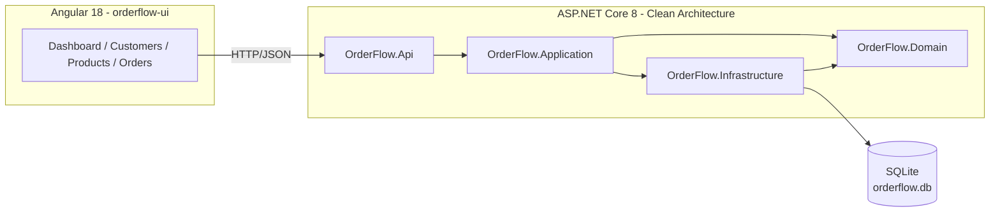

# OrderFlow

A sample full-stack order management application demonstrating a tiered customer-discount engine, built with a .NET 8 Clean Architecture backend and an Angular + Angular Material frontend.

## Architecture



- **OrderFlow.Domain** — entities (`Customer`, `Product`, `Order`, `OrderItem`), enums, and the extensible discount engine (`IDiscountRule`, `IDiscountCalculator`).
- **OrderFlow.Application** — use-case orchestration (`CustomerService`, `ProductService`, `OrderService`), commands/results, repository interfaces.
- **OrderFlow.Infrastructure** — EF Core + SQLite persistence, repository implementations, deterministic seed data.
- **OrderFlow.Api** — REST controllers, FluentValidation request validators, global exception-handling middleware, Swagger, CORS.
- **orderflow-ui** — Angular 18 standalone-component app with Material UI, lazy-loaded feature routes, and a shared discount-preview utility for live order-total estimates.

## Project Structure

```
OrderFlow/
├── OrderFlow.slnx
├── backend/
│   ├── OrderFlow.Domain/
│   ├── OrderFlow.Application/
│   ├── OrderFlow.Infrastructure/
│   └── OrderFlow.Api/
├── frontend/
│   └── orderflow-ui/
├── tests/
│   ├── OrderFlow.UnitTests/
│   └── OrderFlow.IntegrationTests/
└── specs/
    └── 001-order-discount/spec.md
```

## Technologies

| Layer | Stack |
|---|---|
| Backend | ASP.NET Core 8 Web API, EF Core 8 + SQLite, FluentValidation |
| Frontend | Angular 18 (standalone components), Angular Material, RxJS |
| Testing | xUnit, Moq, `Microsoft.AspNetCore.Mvc.Testing` (WebApplicationFactory) |

## Running the App

### Backend

```powershell
cd backend/OrderFlow.Api
dotnet run
```

The API starts on `http://localhost:5048` (Swagger UI at `/swagger` in Development). On first run it creates `orderflow.db` (SQLite) in the working directory and seeds it with sample customers and products.

### Frontend

```powershell
cd frontend/orderflow-ui
npm install   # first time only
ng serve
```

The app runs on `http://localhost:4200` and calls the API at `http://localhost:5048/api` (see `src/environments/environment.ts`). CORS is enabled on the API for `http://localhost:4200`.

### Tests

```powershell
# from the OrderFlow/ root
dotnet test OrderFlow.slnx
```

Runs 19 unit tests (discount rules + `OrderService`) and 10 integration tests (full API + order lifecycle via `WebApplicationFactory`) — 29/29 passing.

## API Endpoints

| Method | Route | Description |
|---|---|---|
| GET | `/api/customers` | List customers |
| POST | `/api/customers` | Create a customer |
| GET | `/api/customers/{id}` | Get a customer |
| GET | `/api/products` | List products |
| POST | `/api/products` | Create a product |
| GET | `/api/products/{id}` | Get a product |
| GET | `/api/orders` | List orders (summary view) |
| POST | `/api/orders` | Create an order (calculates discounts) |
| GET | `/api/orders/{id}` | Get full order detail |
| POST | `/api/orders/{id}/confirm` | Confirm a Pending order |
| POST | `/api/orders/{id}/cancel` | Cancel a Pending order |

## Seed Data

**Customers** (deterministic GUIDs, email `{name}@orderflow.test`):

| Name | Tier |
|---|---|
| Alice | Standard |
| Bob | Silver |
| Charlie | Gold |
| David | VIP |

**Products** (all active):

| Name | SKU | Price |
|---|---|---|
| Laptop | LAPTOP-001 | ₹80,000 |
| Monitor | MONITOR-001 | ₹25,000 |
| Keyboard | KEYBOARD-001 | ₹5,000 |
| Mouse | MOUSE-001 | ₹2,000 |

## Discount Rules

Discounts are computed by `IDiscountRule` implementations and combined by `DiscountCalculator`:

1. **Customer tier discount** — Standard 0%, Silver 5%, Gold 10%, VIP 10%.
2. **Large order discount** — an additional 5% when the order subtotal exceeds ₹10,000.
3. **Cap** — the combined discount percentage is capped at **20%**, regardless of how many rules apply.

Example: a VIP customer orders ₹110,000 worth of goods → 10% (tier) + 5% (large order) = 15% discount → ₹16,500 off → final total ₹93,500.

New discount rules can be added by implementing `IDiscountRule` and registering it in `InfrastructureServiceCollectionExtensions` — no changes to `OrderService` or the calculator are required.

## Design Notes / Assumptions

- DTOs are split between `Application/Contracts` (commands/results used internally) and `Api/Contracts` (request/response models exposed over HTTP) to keep the API's wire format independent of the Application layer.
- The database is created via `EnsureCreated()` rather than EF Core migrations, since this is a sample project with no schema evolution requirements.
- Applied discounts are **recomputed on read** from `Order.Subtotal` and `Customer.Tier` rather than persisted line-by-line, avoiding extra schema while keeping the discount calculation consistently testable at both creation and retrieval time.
- The Angular order-creation screen mirrors the discount rules client-side for a live preview; the value returned by the API after `POST /api/orders` is always the authoritative result.
- Products have no update/edit endpoint in this sample, so the Products screen only supports listing, searching, and creating.
